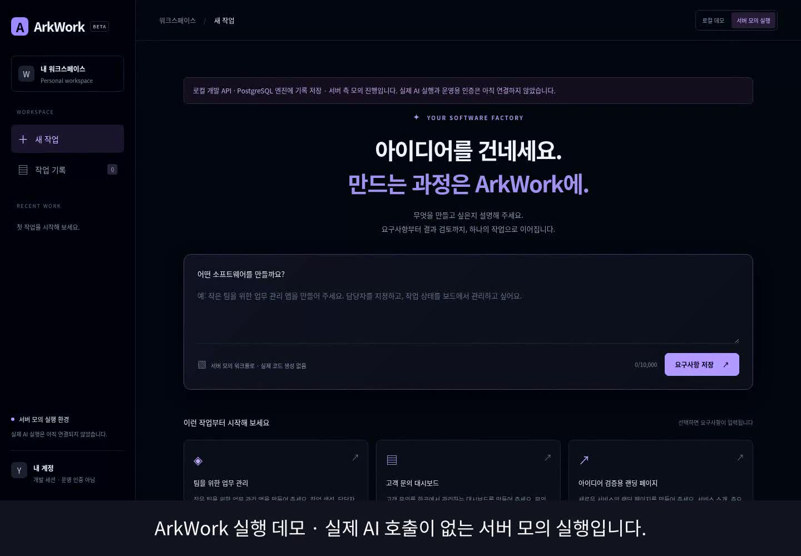

# ArkWork 실행 데모

[MP4 영상 보기·다운로드](https://raw.githubusercontent.com/yth1209/ArkWork/main/docs/demo/arkwork-demo.mp4)



현재 main의 실제 화면을 Chromium에서 녹화한 한국어 자막 영상입니다. 요구사항 입력, 승인 전 대기와 계획 확인, 명시적 승인, 서버 큐 진행, 결과 검토·요약 다운로드, 새로고침 후 서버 기록 재조회를 보여줍니다. 영상의 실행은 fixture이며 실제 AI·코드 생성·테스트·PR 생성은 수행하지 않습니다. 음성은 포함하지 않습니다.

[영상에서 다운로드한 작업 요약](sample-work-summary.md)

## 재현

Node.js 24 이상, 설치된 npm 의존성, Chromium, FFmpeg(libx264·subtitles 필터 및 한국어 Noto Sans CJK 글꼴)가 필요합니다. Playwright 녹화용 FFmpeg는 `npx playwright install ffmpeg`로 설치합니다.

```sh
CHROMIUM_PATH=/usr/bin/chromium node scripts/record-demo.mjs
```

다운로드가 제한된 현재 클라우드에서는 시스템 FFmpeg를 연결해 실행했습니다.

```sh
mkdir -p /tmp/arkwork-playwright/ffmpeg-1011
ln -sf /usr/bin/ffmpeg /tmp/arkwork-playwright/ffmpeg-1011/ffmpeg-linux
PLAYWRIGHT_BROWSERS_PATH=/tmp/arkwork-playwright CHROMIUM_PATH=/usr/bin/chromium node scripts/record-demo.mjs
```

스크립트는 별도의 임시 DB와 API 3002·UI 5174 포트를 사용합니다. 개발 DB의 작업 기록을 변경하지 않습니다. 두 포트가 비어 있어야 합니다. 기본 결과 경로는 `docs/demo`이며 `DEMO_OUTPUT`으로 변경할 수 있습니다. MP4(H.264), 미리보기 이미지, 다운로드된 Markdown을 생성하고 녹화용 서버·DB를 종료·제거합니다. 녹화 중 UI 오류와 승인 전 실행 버튼 비활성 상태도 검사합니다.
