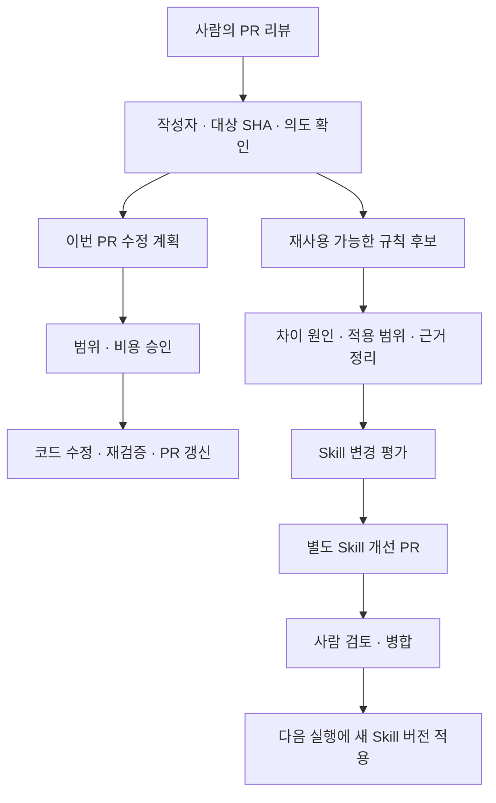

# PR 피드백과 Skill 개선 루프

상태: 설계 제안. 현재 Codex 세션이나 ArkWork UI에 이 자동화가 이미 존재한다는 의미가 아니다.

## 1. 서로 다른 두 루프



내부 루프는 지금 PR을 올바르게 만드는 일이다. 외부 루프는 이후 리뷰와 구현을 개선하는 일이다. 코드 수정의 승인이 전체 규칙 변경의 승인이 되는 것은 아니다. 외부 루프가 실패해도 승인된 이번 PR 수정은 독립적으로 진행한다.

## 2. 피드백 수집과 실행 승인

GitHub App webhook으로 inline comment, review submission, discussion comment와 수정·삭제 이벤트를 수집한다. comment ID, thread, 작성자 권한, 본문 버전, original commit, 최신 PR head를 보존한다. 누락 복구는 cursor 기반 주기 조회와 겹치는 조회 구간으로 보완한다.

봇 출력은 installation과 등록된 bot identity로 식별한다. 코멘트의 문구나 emoji만으로 봇 또는 유지관리자를 판정하지 않는다. GitHub reaction은 보조 신호이며, “좋아요”, “감사합니다”, 해결 표시 또는 병합 자체를 모든 제안에 대한 동의로 해석하지 않는다.

일반 코멘트는 피드백함에 쌓인다. 승인 가능한 사용자가 앱에서 항목을 선택하거나 명시적 수정 요청을 제출하면 수정 계획을 만든다. 공개 저장소의 외부 작성자 요청은 검토 데이터로만 수집하고 실행을 시작하지 않는다. 정책·도메인·자격 증명 확대 요청은 코드 수정과 분리한다.

삭제·수정된 피드백은 tombstone 또는 새 버전으로 처리한다. 아직 승인되지 않은 후보는 다시 계산하고, 이미 병합된 규칙의 근거가 사라지면 유지관리자에게 재검토 대상으로 표시한다.

## 3. 무엇을 분석하는가

| 결과 분류 | 의미 | 학습 처리 |
| --- | --- | --- |
| validated | 사람의 구체적 판단이 제안을 확인 | 놓친 검증이나 유효한 판단 패턴 후보 |
| corrected | 잘못된 가정·오탐·심각도를 지적 | 왜 잘못됐는지 증거 확인 |
| refined | 방향은 동의하나 범위·선호를 수정 | 프로젝트별 규칙 후보 |
| ambiguous | 의도·근거가 부족 | 규칙 변경 없이 보류 |

원인 분류는 요구사항 누락, 명세 불일치, 저장소 관례 미인식, 기술 오판, 검증 공백, 리뷰 오탐, 심각도 오판, 환경 제약, 정책 변경, 일회성 선호다. 모델의 주관적인 추측만으로 원인을 확정하지 않는다. 원문, diff, 명세와 검사 결과에서 근거를 찾고 대안 원인·불확실성을 함께 기록한다.

## 4. 기록 형식

학습 후보는 작업 데이터로 먼저 저장한다. 승인된 규칙만 repository Skill에 넣는다.

```json
{
  "candidate_id": "lc_example",
  "source": { "repository": "owner/repo", "pr": 12, "comment_ids": [345], "head_sha": "<actual-sha>" },
  "outcome": "corrected",
  "cause": "repository_convention_missing",
  "observed_gap": "구체적인 사람의 지적과 기존 판단의 차이",
  "evidence": ["확인 가능한 코멘트·명세·검사 결과의 참조"],
  "uncertainty": "다른 원인 또는 부족한 정보",
  "proposed_rule": "어떤 상황에서 어떤 행동을 해야 하는지",
  "scope": "repository",
  "target_skill": "review-pr-local",
  "decision": "pending_evaluation",
  "evaluation_id": null
}
```

예시 데이터는 schema 설명이며 실제 피드백이나 확정된 학습을 뜻하지 않는다. 원인 설명은 검토 가능한 요약이다. 내부 사고 과정이나 자격 증명은 기록하지 않는다.

## 5. 규칙 제안 조건

초기 정책은 동일 패턴이 독립적인 작업 2건 이상에서 확인되거나, 유지관리자가 명시적으로 지속 적용할 프로젝트 규칙임을 확인한 경우를 후보로 삼는다. 보안·데이터 손실처럼 중대한 검증 누락은 한 건이어도 즉시 후보를 만들 수 있으나 승인과 평가를 생략하지 않는다.

다음 경우에는 `no_changes`로 기록한다.

- 일회성 제품 선호 또는 특정 파일만의 수정이다.
- 기존 규칙에 이미 충분히 포함되어 있다.
- 근거 없이 reaction이나 코멘트 문구로만 동의를 추정했다.
- 제안이 출력 계약·권한·검증을 약화하거나 모순된다.
- 평가에서 개선을 보이지 않거나 중요한 기존 동작을 훼손한다.

규칙은 범위를 좁게 잡는다. 한 프로젝트의 관례를 조직 전체 기본값으로 승격하지 않는다. 변경이 없다면 분석 보고서는 저장하되 빈 PR은 만들지 않는다.

## 6. Skill 구조와 변경 대상

후속 구현에서 도입할 파일 구조다. 이 기획 PR은 실행 가능한 Skill을 설치하지 않는다.

```text
.agents/skills/
  triage/SKILL.md
  spec/SKILL.md
  implementation/SKILL.md
  verify-behavior/SKILL.md
  review-pr/SKILL.md
  improve-review-pr/SKILL.md
  review-pr-local/SKILL.md
  implementation-local/SKILL.md
```

portable core는 역할·단계·출력 계약을 정의하고, local companion은 저장소별 관례를 보완한다. service policy는 별도 코드·설정으로 권한과 예산을 강제한다. Skill 텍스트로 정책을 우회할 수 없다.

첫 외부 루프는 Warp처럼 `review-pr` 개선에 제한한다. 실제 구현 판단의 반복 실패가 검증되면 `implementation-local` 등으로 확장한다. 모든 코멘트가 “메인 작업 Skill” 전체를 변경하는 모델은 채택하지 않는다. 초기 실행 순서는 정책 → 승인된 core → 승인된 local → 명세 → 작업 데이터이며, 충돌한 규칙은 자동 실행하지 않고 설명한다.

Skill 업데이트는 기존 Skill 전체를 읽고 작은 diff로 작성한다. 출력 schema·필수 검증·안전 경계의 변경은 일반 학습 PR이 아니라 별도의 계약 변경 PR로 취급한다.

## 7. 평가와 활성화

1. 코멘트의 개인정보·기밀을 제거하고 고정 평가 케이스를 만든다. 원 코멘트는 접근 제한 상태로 참조한다.
2. 기존 Skill과 후보 Skill을 같은 모델·설정·입력으로 비교한다. 개선에 사용한 사례와 독립적인 회귀 사례를 분리한다.
3. 평가 rubric은 요구사항 충족, 근거 있는 findings, false positive, severity, 출력schema, 비용·지연이다.
4. 최소 10개 회귀 사례를 준비하고 critical 탐지·권한·schema 검사에서 회귀가 없어야 한다. target 사례 개선과 관련 없는 새 오탐도 함께 확인한다. 모델 변동성은 반복 실행으로 기록한다.
5. 평가 집합이 부족하면 “검증 부족”으로 보류하고 자동 규칙 변경을 하지 않는다. 사람이 예외를 승인한 경우 그 사유와 위험을 남긴다.
6. 별도 Skill PR에는 출처, 원인, 적용 범위, 거절한 대안, 평가 결과와 변경 내용을 포함한다. 기밀 피드백을 공개 PR에 복사하지 않는다.
7. 사람이 병합한 다음 새 Skill bundle SHA를 등록한다. 이미 시작된 작업은 고정된 버전을 사용하고 다음 실행부터 적용한다.
8. 오탐·실패가 늘면 이전 bundle로 되돌릴 수 있다. 저장소 원복도 PR로 남긴다. 긴급 실행 중지와 기존 버전 선택은 감사 이벤트로 기록한다.

평가 통과가 모델 자체의 재학습이나 성능 향상을 보장하는 것은 아니다. 변화는 실행 지침의 명시적 버전 변경이다.

## 8. 스케줄과 완료 기준

피드백 수집은 webhook 즉시 처리, 누락 복구는 주기 처리, 학습 합성은 하루 한 번과 수동 실행을 기본안으로 한다. UTC 저장을 사용하고 사용자에게는 지역 시간대를 표시한다. 일일 실행 시 이미 처리한 후보·평가·PR은 재사용하여 비용과 중복 PR을 막는다.

완료 기준은 (1) 코멘트와 코드 수정의 연결, (2) 권한 없는 코멘트 실행 차단, (3) 이번 PR과 규칙 PR의 분리, (4) 근거 부족 시 no_changes, (5) 평가 실패 시 비활성화, (6) 병합 전 새 Skill 미적용, (7) 각 실행에서 사용한 bundle 추적, (8) 기존 버전 복구의 증거다.
