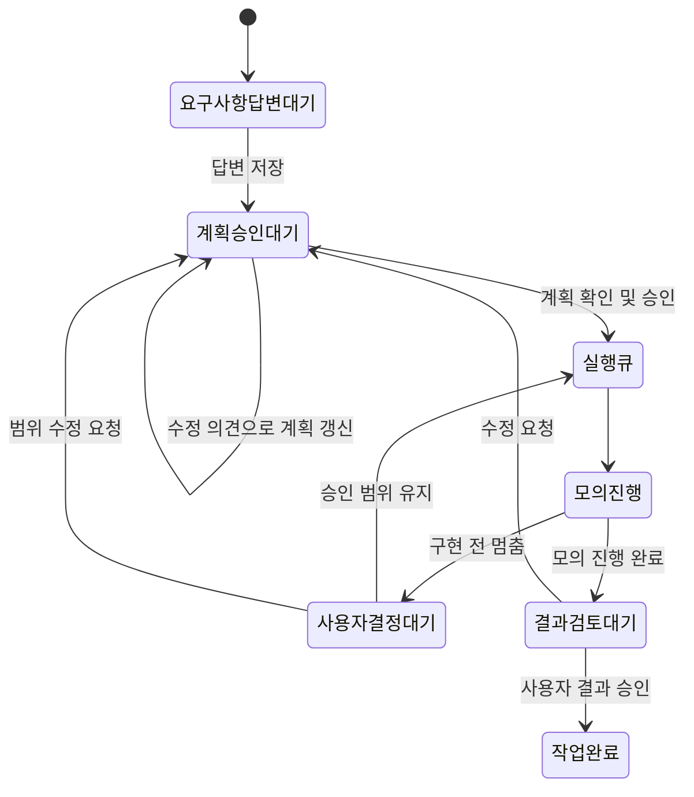

# 사람의 개입과 재개 흐름

현재 구현은 실제 AI가 연결되기 전의 서버 모의 실행이다. 질문·판단·명세를 AI가 생성하지 않으며, 사용자 응답을 기다리는 상태와 응답 후 재개·재승인 계약을 실제 DB와 UI로 검증한다. 새 작업은 기본적으로 이 흐름을 사용한다.

## 사용자 개입 지점

| 지점 | 사용자가 보는 내용 | 사용자 행동 | 대기 중 동작 |
| --- | --- | --- | --- |
| 요구사항 확인 | 사용자·핵심 시나리오, 완료 조건, 제외 범위를 묻는 공통 질문 | 10~2,000자 답변 | 실행 큐 등록 없음 |
| 계획 검토 | 모의 실행 범위·한도, 고정한 사용자 답변과 최신 수정 의견 | 수정 요청 또는 체크박스 후 승인 | 승인 없이 실행하지 않음 |
| 구현 전 결정 | 승인한 범위를 유지할지 변경할지 묻는 데모용 결정 요청 | 범위 유지 후 재개 또는 수정 의견 제출 | lease를 해제하고 실행 중단. 시간이 지나도 자동 재개하지 않음 |
| 결과 검토 | 요구사항·답변·수정 의견·진행 결정의 모의 요약 | 결과 승인 또는 수정 요청 | 검토 대기를 완료로 자동 전환하지 않음 |

질문과 구현 전 결정 요청은 모든 새 작업에서 발생하는 고정된 데모 항목이다. 실제 agent의 불확실성 감지·추가 질문, 구조화 명세·설계 문서 생성 및 수정, 코드 생성·실제 테스트는 후속 작업이다. 입력한 의견을 계획에 저장하는 동작을 실제 구현에 반영했다고 표현하지 않는다.

## 서버 계약

- `awaiting_input`, `awaiting_run_approval`, `awaiting_decision`, `review_ready`는 사람의 응답을 기다린다. `completed`는 사용자가 결과를 승인한 최종 상태다.
- `POST /v1/work-items/:id/responses`: `expected_version`, `action`(`answer`, `revise`, `continue`, `accept`), `text`, `request_key`를 받는다. 세션·출처·요청 보호·workspace 접근을 기존 API와 동일하게 검사한다.
- 응답은 workspace → work → job 순서의 잠금과 트랜잭션으로 저장한다. 작업 버전과 현재 단계가 맞아야 한다. 동일 요청 키·내용 재전송은 다시 적용하지 않는다. 다른 내용으로 키를 재사용하면 충돌한다.
- 답변·최신 수정 의견·수정 회차는 계획 해시에 포함한다. 변경 시 이전 실행 권한을 철회하고 새 계획을 승인받는다. 승인 기록은 회차별로 보존하고 큐는 승인된 현재 계획에만 연결한다.
- 결정 대기에서는 job을 `waiting`으로 전환하고 lease를 해제한다. 이전 worker는 generation이 달라져 진행할 수 없다. 같은 승인 범위 내 재개는 새로운 자동 시도로 계산하지 않는다. 실제 lease 장애 복구는 기존 2회 시도 한도를 따른다.
- workspace당 실행 1건, 승인된 대기·실행 작업 3건에 결정 대기도 포함한다. 답변·계획 승인 대기는 아직 실행 승인된 작업이 아니다. 명시적 수정은 최대 3회이며 회차별 자동 시도 한도는 2회다.
- 답변·진행 결정·수정·결과 승인에는 개발 사용자 식별자를 응답 기록에 저장한다. 계획 승인 사용자도 기존 승인 테이블에 저장한다. UI와 Markdown 요약에서 답변·승인·결정 이력을 확인할 수 있다. 작업 이벤트에는 해당 시점의 버전·계획·상태를 보존한다.

## 호환성과 검증

Migration 003을 추가했다. 001·002는 변경하지 않는다. 기존 작업은 `human_workflow=false`로 기존 진행 방식과 이력을 유지한다. 단계별 개입을 체험하려면 새 작업을 생성한다. 로컬 자동 진행 데모도 유지하지만 기본 진입은 서버 모의 실행으로 변경했다. API와 UI를 함께 실행해야 한다.

29개 자동 테스트는 기존 승인·큐 회귀와 함께 모든 대기 지점, 중복·오래된 응답, 다른 workspace 접근, 수정 후 이전 승인 무효화, 오래된 worker 차단, 대기 중 취소, 회차·동시성 한도, DB를 닫고 다시 열었을 때 결정 대기와 기록 복원을 검증한다. 브라우저 검증은 데스크톱 1440px·모바일 390px에서 답변 → 승인 → 결정 대기 → 재개 → 수정 → 재승인 → 결과 승인, SSE 재연결·기록 유지와 레이아웃을 확인한다.
