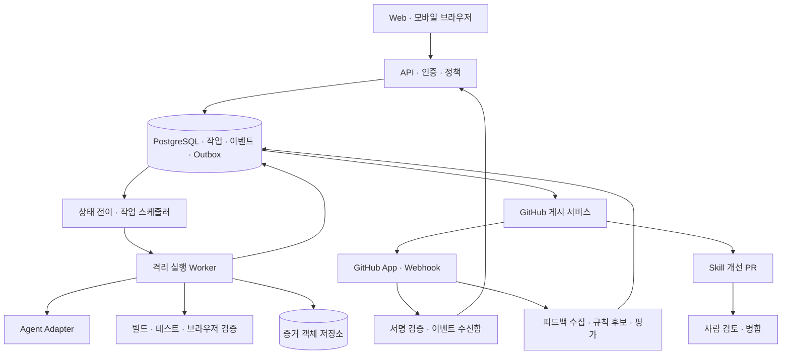
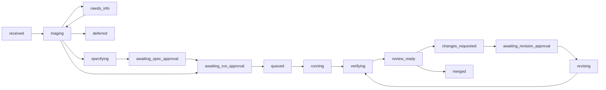

# ArkWork 기술 상세 명세

상태: 제안. 현행 React/Vite UI를 유지하면서 서버와 실행 체계를 단계적으로 추가한다.

## 1. 구조

제어 서비스는 작업 상태와 권한을 담당하고, 에이전트는 범위가 정해진 실행을 담당한다. 에이전트가 자유 텍스트 출력으로 작업 성공이나 병합 권한을 결정하지 못한다.

## 2. 기본 기술안과 선택 이유

| 영역 | 기본안 | 이유·경계 |
| --- | --- | --- |
| 웹 | 현재 React + TypeScript + Vite | UI를 재사용하고 서버 API로 데이터 계층 교체 |
| API | Node.js 24 + Fastify + JSON Schema | 현재 언어 공유, 입력·출력 검증 |
| 저장소 | PostgreSQL | 상태 전이, idempotency, 이벤트와 outbox 원자성 |
| 큐 | MVP는 PostgreSQL 기반 작업 큐 | 별도 Redis 없이 시작, 병렬 규모 확대 때 재평가 |
| 이벤트 표시 | SSE + REST 재조회 | 단방향 진행 스트림, 끊김 후 cursor 복구 |
| 실행 | 격리 컨테이너 worker | 서비스 권한과 비신뢰 코드를 분리; 공개 다중 사용자 단계 전 microVM 등 재평가 |
| 증거 | S3 호환 객체 저장소 | 큰 로그·캡처 분리, 짧은 서명 URL |
| GitHub | GitHub App 설치 토큰 | 저장소별 권한, 단기 토큰과 webhook |
| 모델 | Codex SDK·CLI + ChatGPT 구독 | 개인용 질문·명세 adapter부터 구현. 실제 계정 호출·격리 코드 실행은 후속 검증 |

구체 라이브러리·호스팅 제품은 후속 기술 PR에서 버전과 운영 계약을 확정한다. Codex Plus/Pro 구독이 API 호출 권한이나 서비스 재판매 권한을 제공한다고 가정하지 않는다. 이 채팅 세션을 서버 API로 자동 호출하는 설계도 하지 않는다.

M1 로컬 구현은 PGlite(PostgreSQL 엔진)를 기본으로 사용한다. PostgreSQL 컨테이너 다운로드 제한을 확인했으며 이를 피하려고 인증·TLS 검증을 해제하지 않았다. `DATABASE_URL`로 외부 PostgreSQL adapter를 선택할 수 있지만 그 경로의 실제 통합 검증은 아직 남아 있다. 현재 API는 명시적으로 활성화한 로컬 개발 세션과 모의 진행에 한정되며 운영 배포용이 아니다.

## 3. 데이터 모델

모든 사용자 데이터는 `workspace_id`를 가지며 조회·변경 시 접근 범위를 검사한다. UUID 기본키, UTC 저장, UI는 사용자 시간대로 표시한다.

| 엔티티 | 주요 필드 |
| --- | --- |
| Workspace / Membership | owner, role, policy_version, budget |
| Project | installation_id, repository_id, base_branch, execution_profile |
| WorkItem | source, source_id, requirements, criteria, state, state_version |
| SpecRevision | work_id, commit_sha 또는 plan_hash, approval, approved_by |
| RunAttempt | work_id, stage, attempt_no, base_sha, head_sha, skill_bundle_sha, budget_reservation, lease |
| WorkEvent | work_id, sequence, type, timestamp, redacted_payload |
| Artifact | attempt_id, type, sha256, object_key, target_sha, expiry |
| CheckResult | criterion_id, command, target_sha, exit_code, outcome, artifact_id |
| PullRequestLink | work_id, purpose, repository_id, number, url, head_sha |
| ReviewFeedback | provider_comment_id, author_id, thread_id, target_sha, category, disposition |
| LearningCandidate | source_feedback_ids, diagnosis, scope, proposed_rule, confidence, evaluation |
| SkillRevision | path, git_sha, schema_version, evaluation_id, activated_at |
| UsageLedger | attempt_id, provider_request_id, tokens, compute_seconds, measured_cost, estimated_cost |
| WebhookInbox / Outbox | delivery_id, payload_hash, processing_state, unique_publish_key |

로그에는 읽을 수 있는 판단 요약과 실행 증거를 저장한다. 모델의 내부 사고 로그를 저장 요건으로 삼지 않는다. 요구사항과 캡처에는 기밀이 포함될 수 있으므로 공개 로그에 출력하지 않는다.

## 4. API 계약

모든 API에 인증과 접근 범위 검사를 적용한다. 오류는 `code`, `message`, `retryable`, `request_id`를 반환한다. 권한 거부는 403, 대상 없음은 404, 상태·SHA 충돌은 409, 입력 오류는 422, 사용 제한은 429다.

| API | 목적·주요 입력 |
| --- | --- |
| `POST /v1/projects` | installation과 repository 연결 확인 |
| `POST /v1/projects/:id/work-items` | requirements, criteria, Idempotency-Key |
| `GET /v1/work-items/:id` | 상태·최신 결과·허용된 동작 |
| `GET /v1/work-items/:id/events` | SSE, Last-Event-ID 또는 cursor |
| `POST /v1/work-items/:id/answers` | 추가 질문에 대한 답변 |
| `POST /v1/work-items/:id/approvals` | expected_version, spec_revision, policy_version, budget |
| `POST /v1/work-items/:id/cancel` | expected_version, reason |
| `POST /v1/work-items/:id/retries` | stage, expected_version, 권한·잔여 예산 재확인 |
| `POST /v1/work-items/:id/revisions` | comment_ids, plan_revision, expected_head_sha |
| `POST /v1/work-items/:id/merge` | 명시적 승인, expected_head_sha, GitHub 조건 확인 |
| `GET /v1/work-items/:id/artifacts/:artifactId` | 접근 확인 후 단기 URL 발급 |
| `POST /v1/github/webhook` | GitHub 서명 검증, delivery 저장, 비동기 처리 |

MVP에서 merge API를 생략하면 GitHub 수동 병합과 webhook 동기화로 대체한다. 설계된 API와 출시된 API를 구분한다.

## 5. 상태 전이와 복구

위 그림은 정상 흐름이다. 실패·중단 전이는 다음과 같다.

| 출발 상태 | 도착 상태 | 조건 |
| --- | --- | --- |
| 실행 중 단계 | blocked | 외부 권한·환경·공급자 전제 누락 |
| 실행 중 단계 | failed | 유한 재시도 후 실행·검증 실패, 예산 소진 |
| queued/running/verifying/revising | cancelling→cancelled | 실행 중단과 lease 만료 확인 |
| blocked/failed | 대상 단계의 queued | 원인 해소, 승인 범위 확인, 새 attempt 생성 |
| merged | 종료 | 후속 수정은 새 work item |
| 병합되지 않은 비실행 상태 | closed | 작업 철회, 관련 PR 처리는 별도 확인 |

DB 트랜잭션에서 `state_version`을 비교하고 상태·이벤트·outbox를 함께 저장한다. worker는 만료 시간이 있는 lease와 fencing token을 취득한다. 오래된 worker의 상태 변경과 게시 요청을 거부한다. 외부 부작용에 완전한 exactly-once를 약속하지 않고, 중복 감지와 재조회로 결과의 일관성을 유지한다.

GitHub 이벤트는 at-least-once로 취급한다. delivery ID를 유일하게 저장하고 comment ID와 updated_at으로 수정 버전을 구분한다. webhook은 짧게 응답하고 실제 작업은 비동기로 처리한다. 네트워크 오류·429·일시적 5xx만 지수 백오프로 재시도한다. API 성공 직후 장애가 발생해도 작업 ID를 포함한 PR 마커와 branch/head로 기존 PR을 조회해 중복 생성을 막는다.

재시도 큐에는 `resume_stage`를 저장하므로 구현·검증·게시 실패를 구분해 복구한다. 시작 시 만료된 lease를 확인하고 원격 브랜치·PR 상태를 다시 조회한 뒤 재개한다. 과거 결과와 diff를 덮어쓰지 않는다. force push를 표준 복구로 사용하지 않는다. base 변경과 충돌은 새 분기·재검증 여부를 판단한다. 검증 결과가 최신 head를 대상으로 하지 않으면 게시와 review_ready 전이를 막는다.

## 6. Git·Skill·리뷰의 신뢰 경계

- 실행 시작 시 base SHA, 승인된 명세 SHA, Skill bundle SHA를 고정한다. 브랜치명은 `arkwork/<work-id>/<attempt>`다.
- worker는 제품 코드를 바꿀 수 있지만 GitHub App 비밀키나 호스트 소켓을 갖지 않는다. GitHub 쓰기는 검증된 출력을 받는 별도 게시 서비스가 담당한다.
- 신뢰하는 Skill과 정책은 승인된 Git 리비전에서 읽는다. PR head가 Skill을 수정해도 그 PR을 검토하는 설정으로 채택하지 않는다.
- 리뷰 에이전트는 diff·주변 코드·승인된 명세·이전 리뷰를 읽고 구조화된 `review.json`을 반환한다. schema·행 위치·대상 SHA를 검사한 뒤 게시한다.
- PR 코드를 실행하는 검증은 별도 격리 환경에서만 수행한다. 쓰기 자격 증명이 있는 `pull_request_target` 작업에서 PR 코드를 실행하지 않는다.
- 초기 리뷰 schema는 `verdict: APPROVE|REJECT`, `body`, `findings[]`다. finding은 severity, evidence, path/side/line을 가진다. GitHub 변환은 publisher의 책임이며 Warp schema와 호환된다고 가정하지 않는다.

## 7. 예산과 실행 상한

초기 pilot 제안은 프로젝트 동시 구현 1건, 최대 활성 환경 2개, 구현 attempt당 30분, 실패 수정 2회, 리뷰 수정 3회다. 가격·토큰 상한은 공급자 선정 후 정한다. 이 값은 조정 가능한 기본안이며 성능 보장이 아니다.

시작 전에 예상 비용과 여유분을 예약한다. 병렬 실행은 예약을 원자적으로 취득하고 한도를 초과하는 단계를 시작하지 않는다. 추론·환경·보관·미리보기 비용을 분리한다. 실제 금액을 모르면 추정치로 표시하고 단가의 적용일과 단위를 보존한다.

예산에 도달하면 다음 호출을 막고 진행 중 요청은 공급자가 지원하는 범위에서 중단한다. 과금 반영 지연으로 금액의 완전한 즉시 상한을 보장하지 못할 수 있다. 초과 가능성과 중단 이후 실측 비용을 표시한다. 추가 실행은 예산 변경과 승인이 필요하다.

## 8. 인증·보관·운영

GitHub OAuth는 사용자 인증, GitHub App은 저장소 조작에 사용한다. 로그인과 App 설치 권한을 별도로 확인한다. CSRF 방어, secure cookie, webhook HMAC, 테넌트 분리, 단기 installation token을 적용한다.

worker는 non-root, 자원·시간 상한, 네트워크 허용 대상, 폐기 가능한 디스크를 갖는다. 고객끼리 쓰기 가능한 캐시를 공유하지 않는다. 의존성 설치와 테스트도 격리 환경에서 실행한다. 공개 다중 사용자 운영 전에는 컨테이너 경계만으로 충분한지 별도 검증한다.

pilot 보관안은 원본 로그·영상 7일, 요약·증거 30일, 작업 메타데이터는 프로젝트 삭제까지다. GitHub에 남는 PR·코멘트는 별도 관리임을 설명한다. 삭제 처리·접근 감사·백업 복구 테스트를 구현하고 조직별 보관 정책은 후속 단계에서 제공한다.

관측 대상은 queue 대기, worker heartbeat, 실패율, webhook 지연, GitHub 게시 실패, 공급자 429, 잔여 예산과 artifact 접근이다. 운영 알림은 설정된 수신처에만 보낸다. 이상 감지가 자동 운영 코드 수정 권한을 부여하지 않는다.

## 9. 사용자 미리보기

내부 서버 실행, 화면 캡처, 인증된 리뷰 환경, 공개 배포를 서로 다른 기능으로 취급한다. worker의 localhost를 사용자 접속 주소로 제공하지 않는다.

처음에는 정적 프론트엔드를 외부 호스팅에 올리는 연동부터 제공한다. 실서비스 미리보기는 전용 도메인, 접근 인증, 만료, 로그와 비용 상한을 가진다. 운영 환경의 자격 증명은 주입하지 않는다. 백엔드는 staging DB와 폐기 가능한 데이터를 사용하는 후속 명세로 설계한다.

## 10. 전환과 검증

현행 localStorage 기록은 데모이므로 실제 작업 이력으로 자동 승격하지 않는다. UI 데이터 공급을 `DemoRepository`와 `ApiRepository`로 분리하고 현재 모드를 항상 표시한다. 로그인 후에는 API가 기준이며 다른 브라우저에서도 같은 작업을 보여 준다.

검증은 상태·예산·권한 unit, PostgreSQL·GitHub fixture integration, webhook 서명·중복·순서 변경, worker 종료·취소·API 실패의 장애 주입, 브라우저 E2E, Skill 고정 평가 집합으로 구성한다. 실AI pilot은 별도 예산과 제한된 대상에서 수행한다.

내부 단일 사용자→초대 pilot→조직 운영 순서로 출시한다. 읽기·dry-run→명세 PR→승인된 구현 PR→리뷰 수정→Skill 개선 순으로 권한을 활성화한다. 복구 시 queue와 신규 호출을 멈추고 직전 서비스·Skill 버전으로 전환하며, 실행 중 attempt 종료와 원격 상태 재조회를 수행한다.
